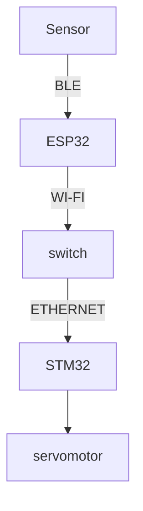
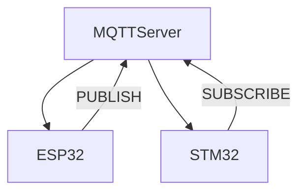

# Création d'une installation domotique de gestion de température et d'humidité dans une salle de bain

## Matériel
Pour la mise en place de ce système, nous utiliserons :

	- Un capteur de température et d'humidité doté d'un système de communication BLE (capteur 'Mi Temperature and humidity' de Xiaomi, modèle LYWSDCGQ/01ZM ),
	- Microcontrolleur ESP32 Lilygo TTGO T-Display,
	- Carte STM32F746NG de STMicroelectronics,
	- Un servomoteur,
	- Un routeur / switch.

Ces équipements vous permettront, à moindre coût, de réaliser cette installation.

## Communications :

### Systèmes de communication internes


### Serveur MQTT



## Mise en place

Pour pouvoir utiliser notre code il vous faudra installer ces IDE :
 
- Visual Studio Code avec l'extension PlatformIO pour pouvoir flasher le code dans la carte ESP32.
- STM32CubeIDE avec un firmware 1.7 en version 1.16.1.
- Un serveur MQTT sur le réseau.

## Paramétrage

### ESP32

Il est nécessaire de changer le paramétrage de connexion au réseau Wi-Fi.
Allez dans le fichier wifi2.cpp et modifiez plusieurs variables:
```c
//Nom du réseau Wi-Fi
const char* ssid = "esp-4";
//Password du réseau Wi-Fi
const char* password = "Azerqsdfwxcv123";
//Ip de la machine hébergeant le serveur MQTT
const char* ipMQTT = "192.168.136.232";
```

### STM32
Il est nécessaire de changer le paramétrage se trouvant dans le fichier app_ethernet.c:
```c
//Ip du serveur MQTT
IP4_ADDR(&server_ip, 192,168,1,122);
```

## 1. Récupération des données du capteur avec la carte ESP32

Dans cette partie, nous avons utilisés PlatformIO comme extension de l'IDE Visual Studio Code, dans le but de pouvoir flash notre code sur la carte ESP32. Le code flashé sur la carte permet de récupérer les trames d'advertising Bluetooth Low Energy (BLE) du capteur, de les filtrer et de les traiter pour récupérer les valeurs de températures et d'humidité.
La carte enverra ensuite les données sur un topic MQTT : 

- NB-CB_temperature
- NB-CB_humidity

Pour ce faire, elle utilise la Wi-Fi pour envoyer les données vers le serveur MQTT.

## 2. Mise en place du serveur 

Pour cette partie, nous avons utilisés le brocker de message Mosquitto. Il suffit simplement de lancer le serveur sur une machine du réseau et de récupérer son IP. L'IP est utilisé pour le paramétrage expliqué plus haut.

## 3. Mise en place de la récupération des données sur le serveur MQTT


## Problèmes rencontrés
