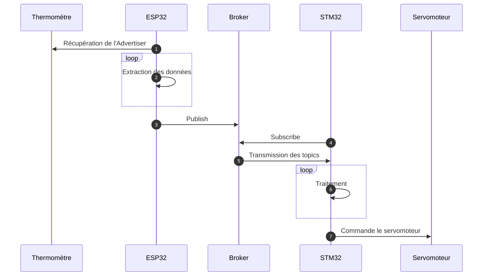
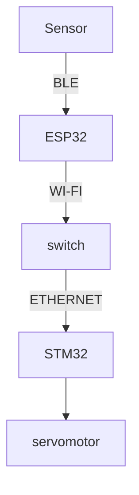

# Création d'une installation domotique de gestion de température et d'humidité dans une salle de bain

## Video
https://youtu.be/zlMbF_yxeT0

## Matériel
Pour la mise en place de ce système, nous utiliserons :

- Un capteur de température et d'humidité doté d'un système de communication BLE (capteur 'Mi Temperature and humidity' de Xiaomi, modèle LYWSDCGQ/01ZM ),
- Microcontrolleur ESP32 Lilygo TTGO T-Display,
- Carte STM32F746NG de STMicroelectronics,
- Un servomoteur,
- Un routeur / switch.

Ces équipements vous permettront, à moindre coût, de réaliser cette installation.

## Schéma d'architecture


## Diagramme de séquence



## Moyens de communications 



## Mise en place

Pour pouvoir utiliser notre code il vous faudra installer ces IDE :
 
- Visual Studio Code avec l'extension PlatformIO pour pouvoir flasher le code dans la carte ESP32.
- STM32CubeIDE avec un firmware 1.7 en version 1.16.1.
- Un serveur MQTT sur le réseau.

## Paramétrage

### ESP32

Il est nécessaire de changer le paramétrage de connexion au réseau Wi-Fi.
Allez dans le fichier wifi2.cpp et modifiez plusieurs variables:
```c
//Nom du réseau Wi-Fi
const char* ssid = "esp-4";
//Password du réseau Wi-Fi
const char* password = "Azerqsdfwxcv123";
//Ip de la machine hébergeant le serveur MQTT
const char* ipMQTT = "192.168.136.232";
```

### STM32
Il est nécessaire de changer le paramétrage se trouvant dans le fichier app_ethernet.c:
```c
//Ip du serveur MQTT
IP4_ADDR(&server_ip, 192,168,1,122);
```

## 1. Récupération des données du capteur avec la carte ESP32

#### Contexte

Dans cette partie, nous avons utilisés PlatformIO comme extension de l'IDE Visual Studio Code, dans le but de pouvoir flash notre code sur la carte ESP32. Le code flashé sur la carte permet de récupérer les trames d'advertising Bluetooth Low Energy (BLE) du capteur, de les filtrer et de les traiter pour récupérer les valeurs de températures et d'humidité.
Le capteur envoie 3 trames d'advertising différentes:

- Une trame avec seulement la température
- Une trame avec seulement l'humidité
- Une trame avec les deux

Nous utiliserons seulement la dernière. Le filtre se base sur le 18ème octet de chaque trame. Celle qui nous intéresse contient 0d en hexadécimal.

Les données sont ensuite récupéré avec les calcules suivant:

- Température : (trame[22] * 256 + trame[21]) / 10
- Humidité : (trame[24] * 256 + trame[23]) / 10

La carte enverra ensuite les données sur un topic MQTT : 

- NB-CB_temperature
- NB-CB_humidity

Pour ce faire, elle utilise la Wi-Fi pour envoyer les données vers le serveur MQTT.

#### Fonctionnement du code

##### Librairies utilisées:
- [EspMQTTClient](https://github.com/plapointe6/EspMQTTClient) pour la connexion wifi et MQTT

##### Explication:
Le main.cpp à deux méthodes : celle de setup des variables et celle qui permet de faire boucler le code sur la carte.
Dans le setup, nous créons un thread pour la gestion du bluetooth avec un listener qui enverra les données en Wi-Fi lors de leur réception.
Les boutons sur la carte ne sont pas attribués mais peuvent être utilisés dans le cadre d'une amélioration via les deux handlers dans le code.

## 2. Mise en place du serveur

Pour cette partie, nous avons utilisés le brocker de message Mosquitto. Il suffit simplement de lancer le serveur sur une machine du réseau et de récupérer son IP. L'IP est utilisé pour le paramétrage expliqué plus haut.

## 3. Mise en place de la récupération des données sur le serveur MQTT

#### Contexte

La carte STM32 va pouvoir s'abonner aux topics NB-CB_temperature et NB_CB_humidity sur lesquels sont publiées les valeurs de température et d'humidité.
Le code que nous avons créé se base sur celui des exemples fournis par l'IDE STM32CubeIDE se nommant LWIP. Notre code est contenu dans les fichiers du répertoire "LwIP_HTTP_Server_Netcon_RTOS".

#### Fonctionnement du code

##### Librairies utilisées:
- [LWIP](https://www.nongnu.org/lwip/2_0_x/group__mqtt.html) pour la connexion MQTT
- lcd_log.h pour la gestion de l'affichage
##### Explication:
Le fichier main.c crée un thread nommé start. Celui-ci va lancer un nouveau thread DHCP qui communiquera avec le serveur DHCP. Une fois son adresse IP attribuée, il commencera à récupérer les données de température et d'humidité via un nouveau thread nommé MQTT.

**Attention** : Sur les STM32, les threads sont synchrones, il faut donc rajouter un "osDelay" qui correspond au temps accordé aux autres threads pour s'exécuter.

le fichier app_ethernet.c contient toutes les méthodes liées aux protocoles DHCP et MQTT.

## 4. Utilisation d'un servomoteur

#### Contexte

Même si ce système n'est pas mis en place dans ce projet, le servomoteur est la condition qui permet de gérer l'ouverture de la ventilation en fonction de la température et de l'humidité. Le code permettant de calculer la nécessité de l'ouverture en fonction des valeurs doit se trouver sur la carte STM32. Le servomoteur sera connecté au pins du microcontrolleur pour ordonner la rotation.

#### Fonctionnement théorique du code

Il faut utiliser une des horloges internes de la carte pour ne pas utiliser de timer logiciel. afin de faire bouger le servomoteur comme attendu, il faut appeler une méthode de déclenchement en modifiant les paramètres pour l'horloge (diviseur, temps à l'état haut,...).  


## Problèmes rencontrés

L'installation des différents IDE peut entrainer différents problèmes.

**Attention** : Lors de la création d'un projet sur STM32CubeIDE, l'installation des dépendences peut ne pas fonctionner si le répertoire de destination n'est pas correctement créé, et il se peut donc que vous deviez le créer à la main.

De même, l'installation du plug-in PlatformIO sur VS Code peut entrainer des problèmes selon les droits dont vous disposez ainsi que l'espace mémoire.

Finalement, dans le code de la carte STM32, si vous n'arrivez pas à vous connecter via le serveur DHCP, veuillez changer l'adresse MAC de votre carte en gardant le premier paramètre "2U".
